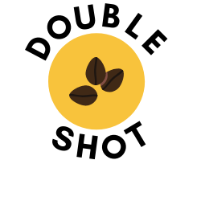

# Double Shot

Double Shot is an online ordering app for coffee. It allows the user to order at their local coffee shop before actually entering the place. It is designed for the user to grab their coffee as soon as they walk in.

# Technologies

This is built with react and redux, it uses SASS as a CSS extension.
The back end aspect is built with Node.js (Express) and uses MongoDB atlas for the database.
